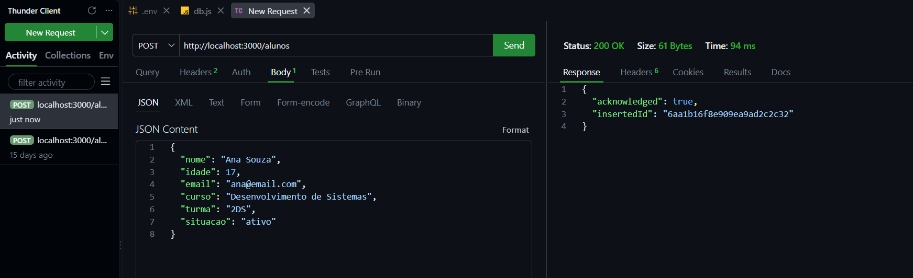
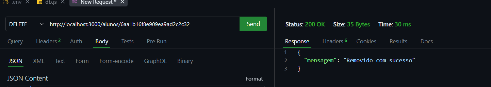

# Gestão Escolar 

Backend para gerenciamento de alunos, feito com **Node.js**, **Express** e **MongoDB**.  
Permite operações de **GET**, **POST** e **DELETE** para manipular dados de alunos.

---

##  Tecnologias
- **Node.js**  
- **Express**  
- **MongoDB**  
- **Thunder Client** (para testes de API)

---

##  Estrutura do projeto
```
gestao_escolar/
│── src/
│   ├── routes/
│   │   └── alunos.js
│   ├── app.js
│   └── db.js
│── .env
│── package.json
│── README.md
│── imagens/   ← pasta para prints
```

---

##  Como rodar localmente
1. **Instalar dependências**  
   ```bash
   npm install
   ```

2. **Configurar `.env`**  
   ```env
   MONGO_URI=mongodb://localhost:27017/gestao_escolar
   ```

3. **Iniciar MongoDB local**  
   - Crie a pasta `C:\data\db` (Windows) ou `/data/db` (Linux/macOS).  
   - Rode o serviço `mongod` para ativar o servidor na porta `27017`.

4. **Rodar o servidor Node.js**  
   ```bash
   npm start
   ```
   O backend estará disponível em `http://localhost:3000`.

---

##  Endpoints
- **GET /alunos** → lista todos os alunos  
- **POST /alunos** → cadastra novo aluno  
  ```json
  {
    "nome": "Maria",
    "idade": 15
  }
  ```
- **DELETE /alunos/:id** → remove aluno pelo ID  

---

##  Prints

### Banco de dados


### GET antes de cadastrar


### POST (cadastro de aluno)


### 3 alunos cadastrados


### DELETE


### GET depois do DELETE


### GET lista depois do DELETE


### Lista depois do DELETE

---
